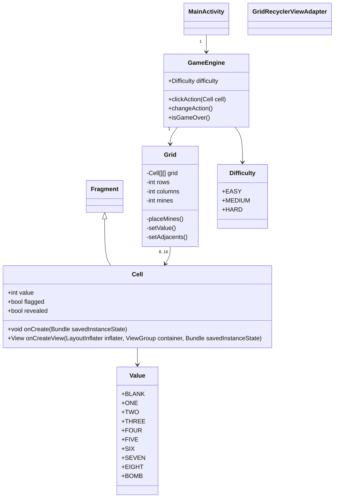

# Minesweeper

Minesweeper android game.

## Information

- Language : Java
- API : 32
- IDE : Android Studio

## Class diagram

```mermaid
classDiagram
    Fragment <|-- Cell
    Grid "8..16" --> Cell
    GameEngine "1" --> Grid
    MainActivity "1" --> GameEngine
    GameEngine --> Difficulty
    Cell --> Value

    class Cell{
        +int value
        +bool flagged
        +bool revealed
        +void onCreate(Bundle savedInstanceState)
        +View onCreateView(LayoutInflater inflater, ViewGroup container, Bundle savedInstanceState)
    }
    class Grid{
        -Cell[][] grid
        -int rows
        -int columns
        -int mines
        -placeMines()
        -setValue()
        -setAdjacents()
    }
    class GameEngine{
        +Difficulty difficulty
        +clickAction(Cell cell)
        +changeAction()
        +isGameOver()
    }
    class MainActivity{

    }
    class Difficulty~enum~{
        +EASY
        +MEDIUM
        +HARD
    }
    class Value~enum~{
        +BLANK
        +ONE
        +TWO
        +THREE
        +FOUR
        +FIVE
        +SIX
        +SEVEN
        +EIGHT
        +BOMB
    }
    class GridRecyclerViewAdapter{
        
    }
```

## Screenshots