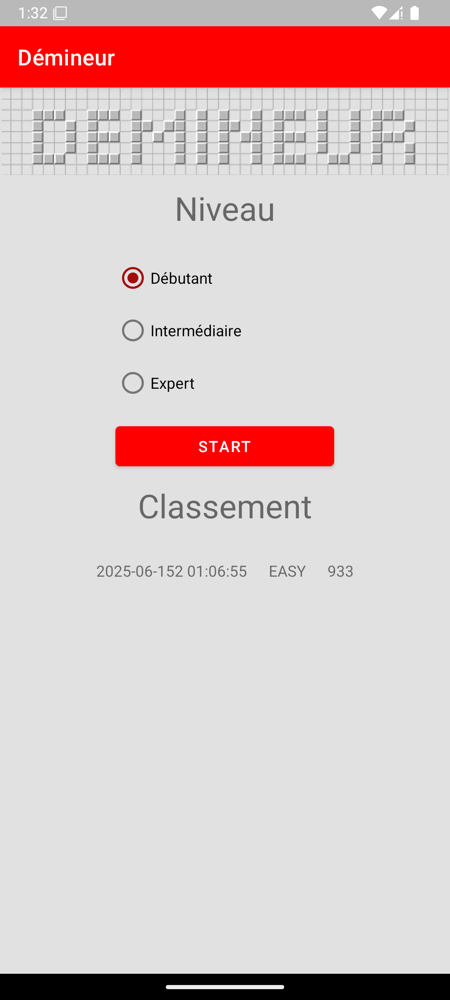
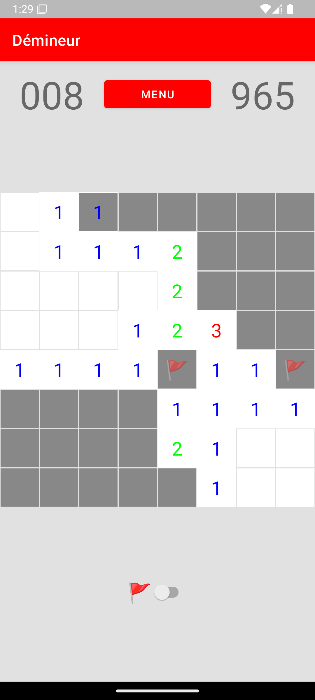
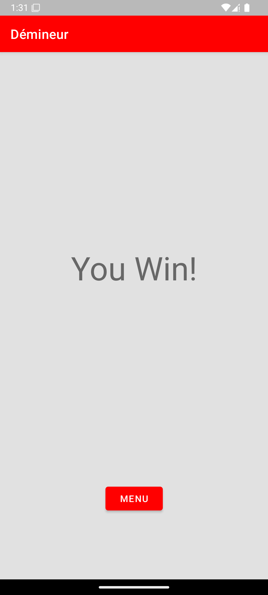
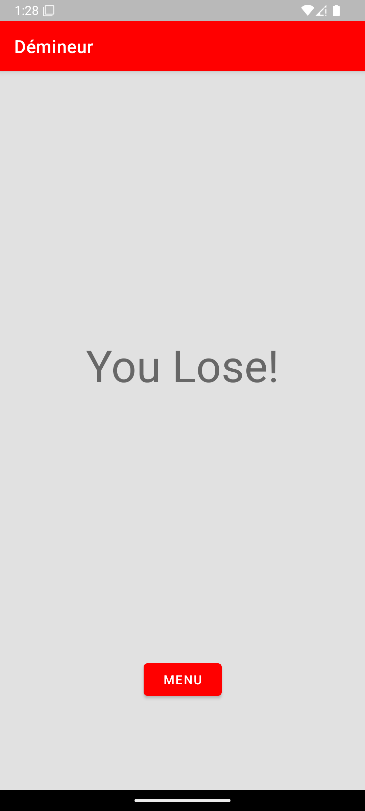

# Minesweeper

A classic Minesweeper game for Android, developed as part of my engineering school curriculum to learn Android app development with Java.

| Menu                   | In-Game                    | Win                  | Lose                   |
| ---------------------- | -------------------------- | -------------------- | ---------------------- |
|  |  |  |  |

## Features

- Classic Minesweeper gameplay
- Multiple difficulty levels
- Intuitive touch controls
- Win and lose screens
- Responsive and user-friendly UI

## Technologies Used

- **Language:** Java
- **Platform:** Android (API 32)
- **IDE:** Android Studio

## Getting Started

1. Clone the repository:
   ```sh
   git clone https://github.com/yourusername/minesweeper.git
   ```
2. Open the project in Android Studio.
3. Build and run the app on an emulator or Android device.
